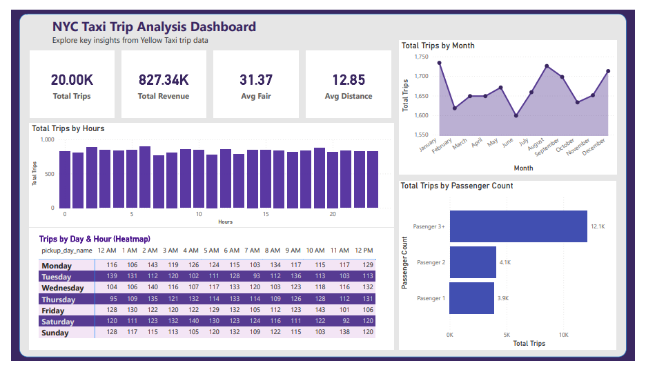

🚕 NYC Taxi Trip Analysis
📊 Project Overview
This project analyzes NYC Yellow Taxi trip data using SQL and Power BI to uncover patterns in trips, revenue, and customer behavior.

🛠️ Tools Used

SQL (MySQL)
Power BI

📈 Key Insights

Peak trip hours identified during morning and evening
Weekends show higher trip demand
Passenger count 3+ contributes maximum trips
Revenue trends analyzed month-wise

📂 Files Included

NYC_Taxi_Analysis.pbix → Power BI Dashboard
taxi_project_queries.sql → SQL Queries
NYC_Taxi_Dashboard.pdf → Dashboard Export

🚀 How to Use

Run SQL queries to prepare dataset
Connect Power BI to database
Load and visualize data

📸 Dashboard Preview

👨‍💻 Author
Rijul
